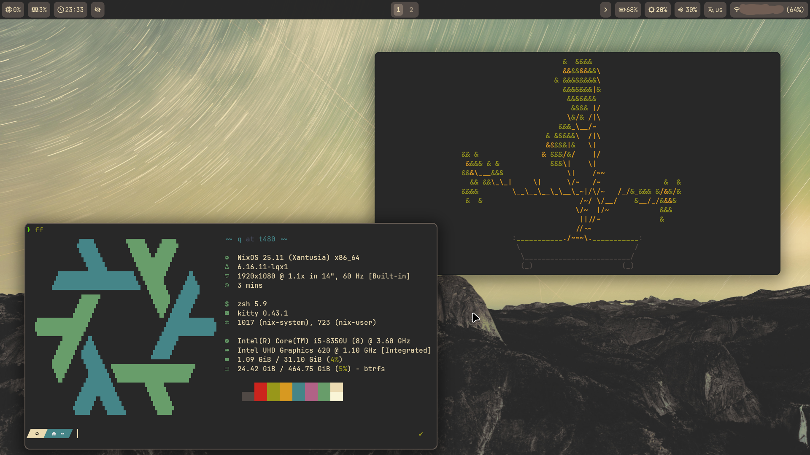

# ❄️ NixOS Config
My awesome NixOS configuration inspired by [Ampersand's flake](https://github.com/Andrey0189/nixos-config-reborn).  
> [Mirrored to GitHub, main repository is on Codeberg.](https://codeberg.org/ae7er/nixos-config)



## ✨ Features
- 💻 **Multi-Host**: ease of configuration for different PCs/hosts.
- 🎨 **Themes**: a lot of [color palettes](https://github.com/tinted-theming/schemes) that you can use for supported apps with [Stylix](https://nix-community.github.io/stylix/configuration.html#handmade-schemes).
- 🏠 **Home Manager**: lots of configured stuff which is same on different hosts.
- 👣 **Desktop Environment**: GNOME with essential extensions. (Dash to Dock, Accent Directories, AppIndicator etc.)
- ✍️ **Code editor**: Themed VSCode with Vim emulation.
- 🛠️ **Shell**: zsh with powerlevel10k and bare minimum of plugins.

## ⚙️ Installation
1. **First, install NixOS**: [Official installation guide](https://nixos.org/manual/nixos/stable/#sec-installation) will help you with this, *but if you have already installed NixOS, skip this.*  
2. **Clone this flake**:
  ```bash
  git clone https://codeberg.org/ae7er/nixos-config
  cd nixos-config
  ```
3. **Copy one of my host's configuration to make your own**:
  ```bash
  cd hosts
  cp -r b450m <hostname>
  cd <hostname>
  ```
  > Replace `<hostname>` with your preffered hostname.
4. **Copy your hardware configuration here**:
  ```bash
  cp /etc/nixos/hardware-configuration.nix ./
  ```
5. **Edit local and home packages if needed**:
  ```bash
  vim local-packages.nix
  vim ../../home-manager/home-packages.nix
  ```
6. **Edit `flake.nix`**:
  ```diff
  ...
    outputs = { self, nixpkgs, home-manager, stylix, ... }@inputs: let
      system = "x86_64-linux";
  --  homeStateVersion = "25.05";
  ++  homeStateVersion = "<home-state-version>";
  --  user = "q";
  ++  user = "<username>";
      hosts = [
  --    { hostname = "t480"; stateVersion = "25.05"; }
  --    { hostname = "b450m"; stateVersion = "25.05"; }
  ++    { hostname = "<hostname>"; stateVersion = "<state-version>"; }
      ];
  ...
  ```
7. **Rebuild system**:
  ```bash
  cd nixos-config
  nixos-rebuild switch --flake ./#<hostname>
  home-manager switch --flake ./#<hostname>
  ```
  > Replace `<hostname>` with hostname from step 3.  

Then reboot and you are good to go!
> Don't forget to adapt some modules like `git.nix` or `nh.nix`!

## 👍 Tips and tricks
1. After installing this configuration you can easily rebuild system and Home Manager with aliases declared in `home-manager/modules/shell.nix`.
2. You can change color palette in `home-manager/modules/stylix.nix`. After the change you need to re-login or the GNOME theme will not apply.

## 🤝 Credits
- **BIG THANKS** ❤️ to [**Ampersand**](https://github.com/Andrey0189). Because I am new in NixOS, I mostly inspired by his configuration and video-guide ([Russian](https://youtu.be/watch?v=HOq7XTygAAU) and [English](https://youtu.be/watch?v=nLwbNhSxLd4)).
- My old (October-December of 2024) unreleased flake.